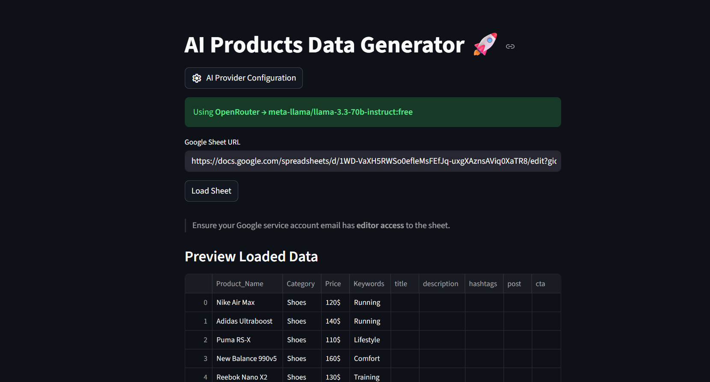
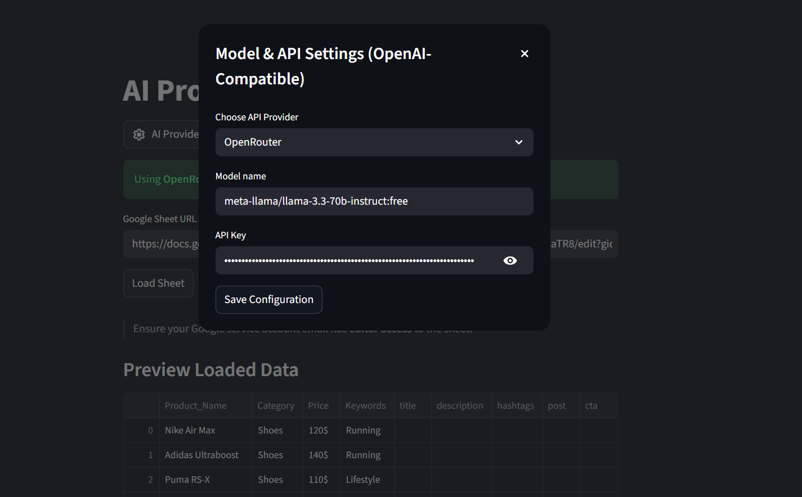
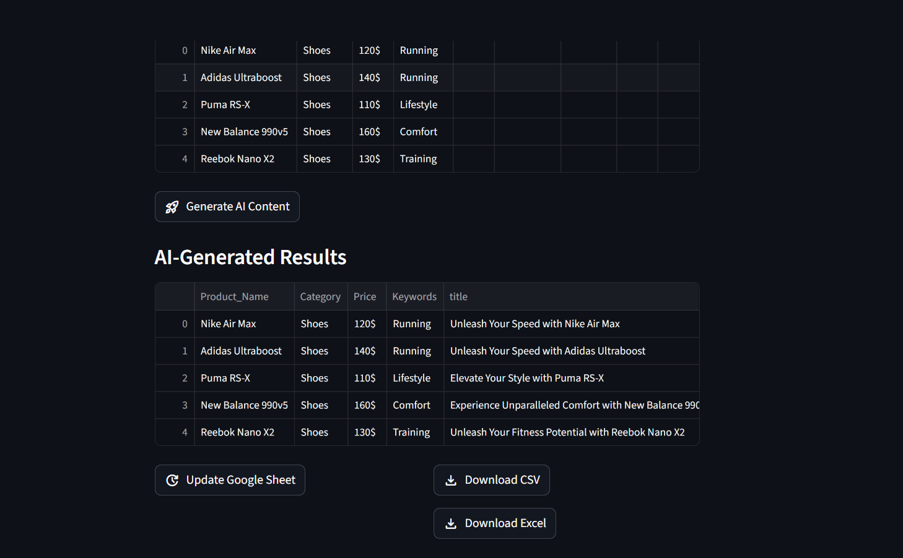

# 🚀 AI Products Data Generator

**Generate high-quality marketing content from Google Sheets using ANY OpenAI-compatible AI model.**
Supports Groq, Gemini, OpenAI, OpenRouter, and Custom providers — all inside a modern Streamlit UI.








 
---

# ✨ Features

### 🧠 AI Marketing Content Generation

Automatically generates for each product:

* **Title**
* **Description**
* **Hashtags**
* **Social media post**
* **CTA (Call To Action)**

Supports any provider that uses the **OpenAI API schema**, including:

| Provider       | Example Models                   |
| -------------- | -------------------------------- |
| **Groq**       | LLaMA 3.3 70B, LLaMA 3.1 8B      |
| **OpenAI**     | GPT-4.1, GPT-4o, GPT-4.1-mini    |
| **Gemini**     | Gemini 2.0 Flash, Gemini 1.5 Pro |
| **OpenRouter** | Many community models            |
| **Custom**     | Any base URL + model             |

All settings are configured through a **clean modal dialog**.

---

### 📄 Google Sheets Integration

Your sheet must contain:

| Product_Name | Category | Price | Keywords |
| ------------ | -------- | ----- | -------- |

Generated content is written back into columns:

| title | description | hashtags | post | cta |

The app also previews the sheet and validates missing columns.

---

### ⚡ High-Performance Async Generation

Your app uses `asyncio.gather()` to generate AI responses for **all products in parallel**, resulting in fast performance even with large sheets.

---

### 🎨 Modern Streamlit UI

* Modal AI provider setup
* Status badges (current provider & model)
* Progress spinner during processing
* Data previews
* Clean export buttons
* Error/warning handling
* Beautiful layout with icons

---

### 📤 Export Options

Download your results instantly as:

* **CSV**
* **Excel (.xlsx)**

---

# 📁 Project Structure

```
├── main.py                    # Streamlit app
├── utils.py                   # AI + Sheets backend logic
├── google_service_account.json
├── requirements.txt
└── README.md
```

---

# 🛠 Installation

### 1. Clone the project

```bash
git clone <your-repo-url>
cd ai-products-generator
```

### 2. Install dependencies

```bash
pip install -r requirements.txt
```

### 3. Add your `.env` file (optional)

```env
# Not required if API key is entered in the UI
OPENAI_API_KEY=
```

### 4. Add your Google Service Account JSON

Place:

```
google_service_account.json
```

The **client_email** inside this file must have **editor access** to your Google Sheet.

---

# 📄 Preparing Your Google Sheet

Your sheet must contain the following headers in row 1:

```
Product_Name | Category | Price | Keywords
```

Copy your Google Sheet link into the app and click **Load Sheet**.

---

# ⚙️ AI Provider Configuration

Click:

```
⚙️ AI Provider Configuration
```

Inside the modal dialog:

1. Select Provider (Groq, Gemini, OpenAI, OpenRouter, Custom)
2. Choose or enter a model
3. Enter your API key
4. Save configuration

After saving, you will see:

✔ Currently selected provider
✔ Currently selected model

Displayed at the top of the app.

---

# ▶️ Running the App

Start Streamlit:

```bash
streamlit run main.py
```

Access the local URL displayed in your terminal.

---

# 🧠 How AI Generation Works (Backend Logic)

For each product row:

1. The app creates a prompt using your product data
2. Sends it to your chosen AI model via `AsyncOpenAI`
3. Ensures returned content is **strict JSON**
4. Parses JSON with `json5`
5. Adds fallback defaults if parsing fails
6. Returns a merged dictionary of original + generated content

All rows are processed **asynchronously in parallel**.

---

# 📤 Updating the Google Sheet

Click:

```
🔄 Update Google Sheet
```

The app writes the following into columns `E: I`:

```
title | description | hashtags | post | cta
```

The update is done in **one batch request** for maximum speed and reliability.

---

# 📦 requirements.txt

```
streamlit
gspread
google-auth
pandas
python-dotenv
openai
json5
```

---

# 🛡 Error Handling

The app gracefully handles:

* Missing Google Sheet columns
* API key missing / invalid
* Model missing
* Provider misconfiguration
* Invalid JSON from AI (fallback structure applied)
* Rate limits or failed API requests
* Incorrect Google Sheet URL

---

# 🌟 Roadmap Ideas

* Batch size selector (generate in chunks)
* Multilingual generation (EN/FR/AR)
* Full product catalog PDF export
* Template-based post generation
* Image generation integration

---

# ❤️ Support

If you have ideas, feedback, or requests, feel free to open an issue or ask for enhancements.

